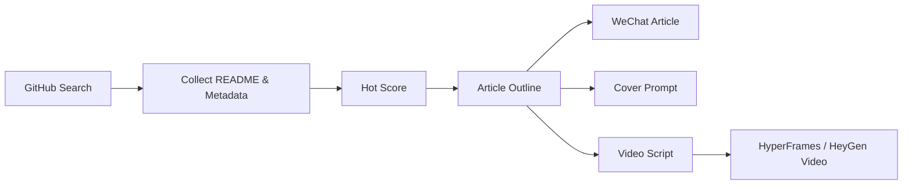

# GitHub Hot Article Studio

把近期 GitHub 热点项目自动整理成适合微信公众号、视频号和短视频平台发布的中文内容。

## 这个项目能做什么

GitHub Hot Article Studio 是一个面向内容创作者、独立开发者和 AI 项目观察者的内容生产流水线。它会从 GitHub 搜索近期活跃的开源项目，读取 README、stars、forks、issues、release、commit 活跃度等信息，生成项目热度评分，然后输出微信公众号长文、封面图提示词、视频脚本和分镜。

适合用于：

- 每日 GitHub 热点项目观察
- AI Agent / LLM / RAG / MCP / 自动化工具项目盘点
- 微信公众号技术文章生成
- 视频号、抖音、B 站项目介绍视频脚本生成
- 个人开发者选题库建设

## 核心流程



## 功能规划

- [x] 关键词配置
- [x] 热点评分模型
- [x] 微信公众号文章模板
- [x] 封面图提示词模板
- [x] 视频脚本模板
- [x] GitHub Actions 定时任务示例
- [ ] GitHub API 实时采集
- [ ] 浏览器截图模块
- [ ] Image Gen 封面生成模块
- [ ] HyperFrames 视频渲染模块
- [ ] 微信公众号 HTML 排版模块

## 快速开始

```bash
git clone https://github.com/hengxiaopai/hengxiaopai-website.git
cd hengxiaopai-website
python -m venv .venv
source .venv/bin/activate  # Windows 使用 .venv\\Scripts\\activate
pip install -r requirements.txt
python -m github_hot_article_studio.main --mode demo
```

## 输出内容

运行后会生成：

```text
outputs/
├─ articles/        # 微信公众号 Markdown 长文
├─ covers/          # 封面图提示词
├─ videos/          # 口播稿、分镜、HyperFrames 脚本草稿
└─ reports/         # 项目评分报告
```

## 推荐文章类型

### 单项目深度文

适合一个项目特别火、有 demo、有应用场景的情况。

### 多项目合集文

适合每天或每周发布，例如：

> 本周 GitHub 上值得关注的 7 个 AI 开源项目

### 项目实测文

适合把项目 clone 下来实际运行，写部署过程、踩坑、效果截图和商业化分析。

## 项目定位

这不是简单的 README 翻译工具，而是一个“AI 开源项目内容媒体系统”：

1. 帮你发现值得写的项目。
2. 帮你判断为什么值得写。
3. 帮你生成公众号文章、封面图提示词和视频脚本。
4. 帮你把技术项目转化成更容易传播的中文内容。

## License

MIT
